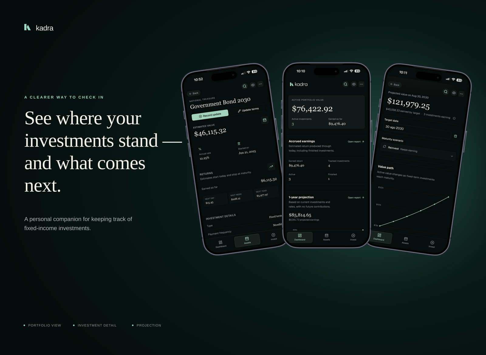

  

<h1 align="center">Kadra</h1>

  <strong>See where your investments stand — and what comes next.</strong> 
  A personal, local-first companion for keeping track of fixed-income investments.

  <a href="https://kadra-app.vercel.app">Try Kadra</a>
  ·
  <a href="TECHNICAL.md">Technical overview</a>
  ·
  <a href="PRODUCT.md">Product context</a>

---

## See Kadra in action

  <video
    src="https://raw.githubusercontent.com/JorgeIba/kadra/main/assets/demo/kadra-demo-1080p.mp4"
    poster="https://raw.githubusercontent.com/JorgeIba/kadra/main/assets/kadra-hero.png"
    controls
    muted
    loop
    playsinline
    width="100%"
  ></video>

## A clearer way to check in

Kadra is a mobile-first PWA for people who want a focused place to understand
the investments they keep track of themselves. It brings the important parts
of a portfolio into one calm, easy-to-scan experience.

Kadra works from information you enter yourself. It keeps a personal record and
calculates estimates for value, earnings, and growth.

### Know where you stand

- See invested balance, estimated earnings, projected growth, and upcoming maturities.
- Review investments by type and status without digging through a noisy dashboard.
- Open the app for a quick check-in and leave with a clearer picture.

### Keep the story intact

- Record contributions, rate changes, and lifecycle changes as an investment evolves.
- Understand how an investment got to where it is today.
- Keep the history behind a projection visible instead of rewriting the past.

### Know what comes next

- Review estimated growth and earnings across the portfolio.
- See which maturities and investment changes deserve attention.
- Explore possible outcomes before deciding what to look at next.

  

Example portfolio data, presented through the current mobile experience.

## Your data stays yours

Kadra works with information you enter yourself. The core experience does not
require an account, connect to financial institutions, move money, or execute
trades.

Portfolio data stays in the browser on your device, and you can export a
user-controlled JSON backup for recovery. Backups are not encrypted, so they
should be kept in storage you trust.

It is not a live financial account or market feed.

## For contributors

See the [technical overview](TECHNICAL.md) for the architecture, domain model,
local development setup, scripts, and testing workflow.

## Documentation

- 🛠️ **[Technical overview](TECHNICAL.md)** — Architecture, persistence, domain calculations, setup, and tests.
- 📜 **[Product context](PRODUCT.md)** — Users, purpose, personality, and principles.
- 🎨 **[Design system](DESIGN.md)** — Visual language, palette, typography, and components.
- ✦ **[Brand identity](docs/brand/README.md)** — Kadra’s mark, wordmark, and asset usage.
- 🧠 **[Domain model](docs/domain-model.md)** — Deeper investment history and derived-state details.
- 🏗️ **[Project plan](docs/project-plan.md)** — Current direction, decisions, and roadmap.
